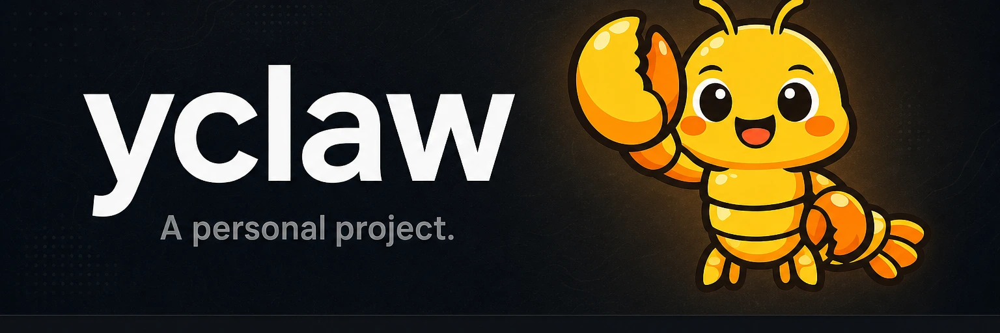

# yclaw



Reproducible, always-on home server for the Nous [`hermes-agent`](https://github.com/NousResearch/hermes-agent) on Apple Silicon.

Every machine and every credential plane rebuilds from this repo. The agent runs sandboxed in a Linux VM that holds none of your API keys — a locked-down macOS guest brokers every credential and injects it on the wire, and the LLM-subscription OAuth lives there too, out of the agent's reach. The setup flow rebuilds the whole stack from a wiped machine; that destroy-and-rebuild is the acceptance test.

## What's here

The stack is a bare macOS host, three tart guests on one tailnet, and a hosted gateway node — all defined as code:

- **host** — bare macOS, no Nix. Homebrew `tart`, Tailscale, and `launchd` boot and supervise the guests; all state and secrets live in `~/.yclaw/state`.
- **metal** guest (macOS, nix-darwin, SIP-on and locked down) — the single credential custodian, credential and AI services only and no iMessage: local Qwen MLX (`omlx`), `granite-speech` STT, CLIProxyAPI (the Codex/Gemini OAuth-to-static-key proxy), and the `agent-vault` broker.
- **bluebubbles** guest (macOS, SIP-off, its own tailnet node) — the iMessage channel only, via the BlueBubbles server; holds no credentials.
- **hermes** guest (NixOS) — the `hermes gateway` in a Docker sandbox; holds no credentials and reaches the internet only through the agent-vault proxy.
- **ai** — hosted Tailscale Aperture, routing `http://ai/v1` to the metal model upstreams.

The architecture is decided and documented; this repo is the implementation. The model fallback chain (`gpt-5.5`, then `gemini-3.5`, then local `qwen`), the credential custody model, and every config choice are spelled out in the docs below.

## Layout

```
flake.nix              # the metal (nix-darwin) and hermes (NixOS) configs; pins all inputs
justfile               # the setup flow + per-node recipes
packer/                # the metal + bluebubbles macOS base images (from a pinned IPSW)
nixos/                 # the hermes gateway VM
darwin/                # the metal guest: services + credential custody
pkgs/                  # agent-vault + cli-proxy-api Go derivations
scripts/               # idempotent glue for the imperative macOS steps
secrets/               # PLACEHOLDERS.md + secrets.sops.yaml.example (real secrets live in ~/.yclaw/state)
docs/                  # ARCHITECTURE.md, DEPLOY.md
```

## Bootstrap

You need an Apple Silicon Mac on macOS Sequoia 15+, a Tailscale tailnet, and [Homebrew](https://brew.sh) (it installs `tart` and Tailscale; Nix runs inside the guests, not on the host).

Run the entrypoint from a clone of this repo:

```bash
just bootstrap
```

It prompts for the human-supplied values in [`secrets/PLACEHOLDERS.md`](secrets/PLACEHOLDERS.md), mints and encrypts the runtime secrets with sops into `~/.yclaw/state`, builds or pulls the VM images, boots the guests, and ends by printing the **human gates** — the interactive one-time steps that cannot be scripted (the bluebubbles Apple-ID iMessage sign-in, the Codex/Gemini browser logins on metal, and the Google OAuth consent). Complete those, then verify:

```bash
just smoke
```

To tear down and prove reproducibility end to end:

```bash
just rebuild   # destroy, then bootstrap from zero
```

## Documentation

- [Architecture](docs/ARCHITECTURE.md) — the target topology, the model plane, and the credential custody model.
- [Deploy](docs/DEPLOY.md) — the high-level deploy flow and what to back up.
- [`AGENTS.md`](AGENTS.md) / [`CLAUDE.md`](CLAUDE.md) — conventions for agents working in this repo.

## Status

The architecture is decided and stable; the implementation is in progress. The target is a bare macOS host driving three tart guests — `metal` (the credential custodian), `bluebubbles` (the iMessage channel), and `hermes` (the sandboxed gateway) — with all state and secrets in `~/.yclaw/state`. Build-out is tracked in [`CHANGELOG.md`](CHANGELOG.md).
