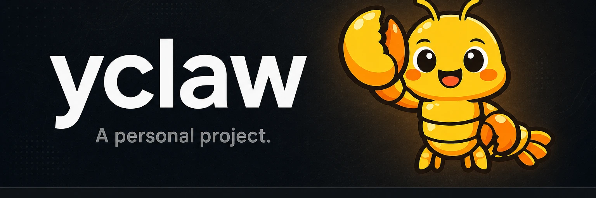
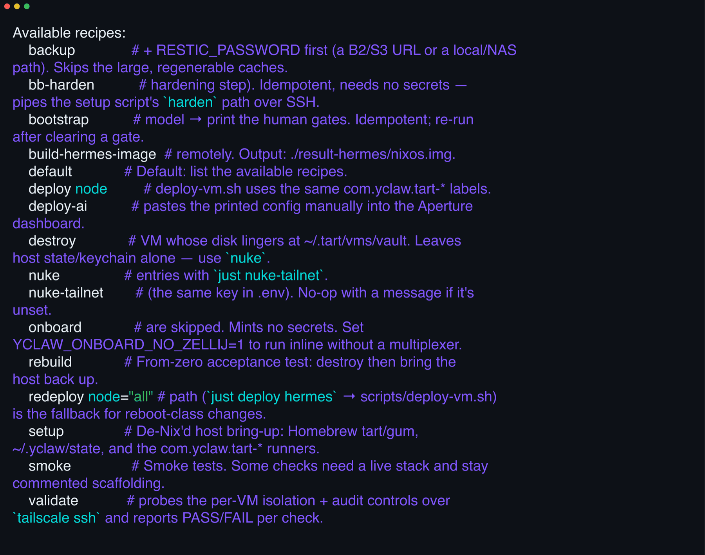

# 

**Root the agent's VM. The keys were never there.** hermes-agent answers your iMessage from a sandboxed Linux VM; a locked-down macOS guest injects every credential on the wire, outside the sandbox.

[](LICENSE)

## Get started

```bash
git clone https://github.com/yasyf/yclaw && cd yclaw
just bootstrap   # preflight, encrypt secrets, build + boot the VMs
just onboard     # TUI for the one-time human gates, then validate + smoke
```



`just bootstrap` preflights the host tools, mints per-host age keys, encrypts each guest's secrets, builds the macOS and Linux images, boots the three guests, and stops at the handful of gates it can't script — the iMessage 2FA, the Codex/Gemini logins, and the `agent-vault` Google OAuth. First boot is long: it pulls the base images and the model weights. Set up an Apple Silicon Mac and a Tailscale OAuth client first — [docs/DEPLOY.md](docs/DEPLOY.md) has the prerequisites and the full walkthrough.

Driving with an agent? Paste this:

```text
Set up yclaw (https://github.com/yasyf/yclaw) on this Apple Silicon Mac.
Read docs/DEPLOY.md first: add the tag:hermes/metal/bluebubbles ACL block and create the Tailscale OAuth client, then run `just bootstrap`.
When the wizard prints the human gates, hand them to me, then drive `just onboard`.
First goal: `just validate` and `just smoke` pass, with hermes answering `tailscale ssh admin@hermes -- hermes doctor`.
```

---

## Use cases

### Run an always-on personal agent you text over iMessage

Standing up a personal agent you can reach from your phone means wiring a message bridge, a gateway, and a model plane by hand. yclaw boots all of it as launchd-managed [tart](https://tart.run) VMs from one Mac:

```bash
just bootstrap
```

`bluebubbles` bridges iMessage, `hermes` runs [`hermes-agent`](https://github.com/NousResearch/hermes-agent) in a Docker sandbox, and a message from an allowlisted handle routes to the agent — model calls falling back `gpt-5.5` → `gemini-3-pro-preview` → a local Qwen MLX model. Text your home channel and the agent answers.

### Keep every API key and OAuth token out of the agent's reach

An agent that holds your keys can leak them — through a prompt injection, a log line, or a rogue tool call. yclaw never puts a credential inside the sandbox:

```bash
just validate
```

The `hermes` VM holds no API keys; `agent-vault` on `metal` injects each bearer on the wire, and the LLM-subscription OAuth lives on `metal` too. The hermes image build fails loudly if a secret-shaped string leaks into its closure, and `just validate` probes the per-VM isolation over `tailscale ssh`, reporting PASS/FAIL per control.

### Destroy the whole stack and rebuild it from the repo in one command

Home servers rot: you tweak by hand until nothing reproduces. yclaw treats destroy-and-rebuild as the acceptance test:

```bash
just rebuild
```

`rebuild` runs `destroy` — booting out the launchd runners and deleting every tart VM — then `setup` to bring the host back, so the whole stack comes back from this repo alone. The irreplaceable state (`~/.yclaw/state/hosts/` and `agent-vault/`) lives on the host and is captured by `just backup`.

## How it works

Three nodes on your tailnet, reached by Tailscale MagicDNS names:

- **metal** — the locked-down macOS guest and sole credential custodian. Runs the Codex/Gemini OAuth proxy (CLIProxyAPI) and the `agent-vault` broker, and relays the model ports to the host, which serves local Qwen inference (`rapid-mlx`) and speech-to-text behind an idle-unload activator. hermes gets no tailnet route to the host — model calls travel from hermes through metal to the host.
- **bluebubbles** — a separate macOS guest that bridges iMessage. Holds no credentials.
- **hermes** — the Linux gateway that runs `hermes-agent` in a Docker sandbox. Holds no API credentials and reaches the internet only through `agent-vault` on `metal`; its agent state is backed up off-VM.

Real secrets never reach the agent — `agent-vault` injects the API keys and OAuth bearers on the wire. [docs/ARCHITECTURE.md](docs/ARCHITECTURE.md) has the model plane and the credential-custody model in full. `machines.json` at the repo root is the single manifest of nodes, services, ports, and log paths, read by the bash scripts, by Nix, and by the debug CLI below.

## Poke at the fleet

`yclaw` is the repo's debug CLI (Python, run with `uv run yclaw ...` from the repo root):

```bash
uv run yclaw status                    # tailnet + service + health for every node
uv run yclaw logs metal cliproxy -f    # follow a service's logs
uv run yclaw ssh hermes systemctl status hermes-agent
```

| Command | Does |
|---------|------|
| `status` / `doctor` | Fleet health; `doctor` adds the hardening checks (`--live` probes the credential plane) |
| `ssh` / `logs` / `wait` | Run a command, tail logs, block until an endpoint is up |
| `restart` / `bounce` | Kick a service in place, or fully unload/reload its launchd plist |
| `vm` / `secret` | Manage the Tart guests pre-tailnet; read keychain secrets and sops bundles |

Exit codes are scriptable: 0 clean, 1 FAIL, 2 usage, 4 Tailscale check-wall, 5 timeout. `uv run yclaw --help` has the rest.

## Hardware

Apple Silicon only. The host serves the 35B MLX model (~20 GB resident while awake, unloaded after 30 idle minutes) — on a smaller Mac, point `nixos/models.nix` at a smaller model. The guests stay light: `metal` runs 8 GB / 2 vCPU as a relay-and-credential node. Budget ~20-25 GB for the model cache on top of the VM disks, and expect a long first boot while macOS installs and the models download.

## More on yclaw

- [docs/DEPLOY.md](docs/DEPLOY.md) — prerequisites, the deploy walkthrough, the human gates, backup and restore.
- [docs/ARCHITECTURE.md](docs/ARCHITECTURE.md) — topology, the model plane, credential custody.
- [AGENTS.md](AGENTS.md) / [CLAUDE.md](CLAUDE.md) — conventions for agents working in this repo.

Status: personal infrastructure I run at home — the layout and the deploy flow still move. Licensed under [MIT](LICENSE).
